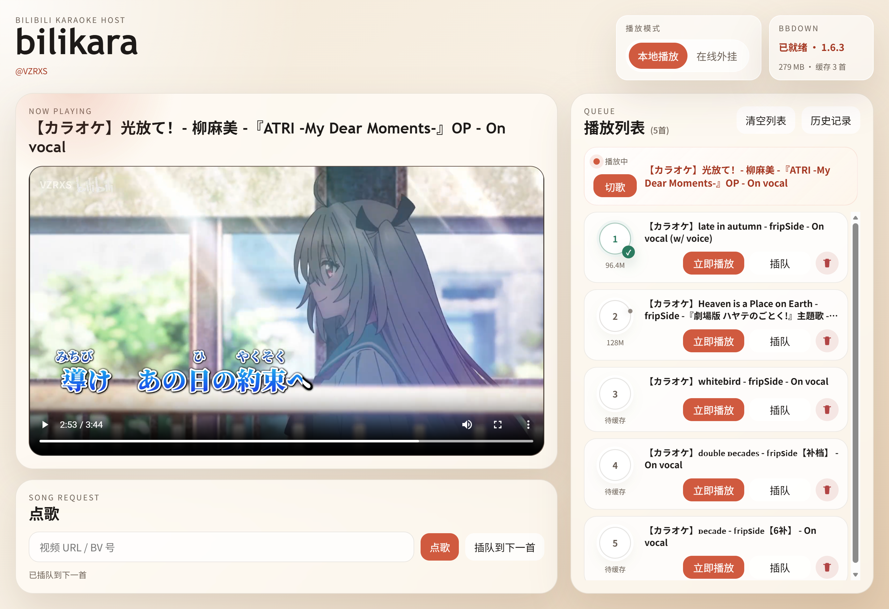

# bilikara
---

`bilikara` 是一个基于 B 站卡拉 OK 视频的点歌平台。主要由 OpenAI Codex 协助设计与实现，并经过人工整理、验证与迭代。



当前版本已经实现：

- 通过 B 站视频链接或 BV 号加入列表（只支持链接指定分 p）
- 在线外挂播放器模式
- 本地缓存播放器模式
- 默认加到列表末尾 / 顶歌到下一首
- 切歌、移除、拖动、顶歌到下一首
- 加入列表后自动后台缓存
- 列表中展示缓存进度条和完成标记
- 最多只自动缓存前 N 首，默认 3 首
- 关闭服务后自动清空缓存目录
- 本地保留歌单备份，重新打开后自动恢复，并可手动清空备份
- 保留点歌历史记录，包括次数、时间，可从历史记录中点歌
- 维护本次点歌记录；同一首歌在本次已点过时，加入前会弹确认
- 按场次单独保存“本次已唱”记录，文件名带日期时间，便于后续读取接口扩展
- 保存对应视频的 up 主信息；历史记录和播放列表悬停时会显示 up 主名


## 启动

**可执行文件**

带 tag 的版本通过 GitHub Actions 打包，在 Releases 下载对应平台的压缩包，直接运行可执行文件。

**脚本启动**

```bash
python start_bilikara.py
```

或 (Ubuntu)

```bash
./start_bilikara.sh
```

启动后会自动打开浏览器；默认优先尝试 `http://127.0.0.1:8080`，如果默认端口被占用，会自动尝试后续端口。

打开的本地页面全部关闭后，服务会在几秒内自动退出。

## 本地打包

需要本地安装 Python，打包后得到可一键运行的可执行文件。

- Windows：`build_windows.bat`
- macOS：`build_macos.command`

它们会自动安装 `PyInstaller` 并生成打包产物到 `dist/`：

- Windows 通常会生成 `dist/bilikara/`，其中的 `bilikara.exe` 可直接双击运行
- macOS 会生成 `dist/bilikara.app`，可直接双击运行

补充说明：

- 打包后的应用会把静态页面资源封装进应用内部
- 打包后的 `data/`、日志、缓存和工具文件默认都会写到应用目录内的 `runtime/`
- 打包脚本会优先把构建机上的 `ffmpeg` / `ffprobe` 一起打进应用；启动时会把它们同步到 `runtime/tools/bbdown/`，与 `BBDown` 放在一起，缓存时优先使用这份应用内工具
- 如果你希望改到别的位置，仍然可以通过 `BILIKARA_HOME` 覆盖
- Windows 和 macOS 的最终包通常需要在各自系统上分别构建；也就是说，Windows 包最好在 Windows 上打，macOS 包最好在 macOS 上打
- Windows 打包脚本会依次尝试 `py`、`python`、`python3`；如果都不存在，需要先安装 Python 3

## 可选环境变量

- `BILIKARA_HOST`：监听地址，默认 `127.0.0.1`
- `BILIKARA_PORT`：监听端口，默认 `8080`
- `BILIKARA_HOME`：自定义应用数据目录；不设置时，打包版默认写入应用目录内的 `runtime/`
- `BILIKARA_MAX_CACHE_ITEMS`：自动缓存窗口大小，默认 `3`
- `BILIKARA_BILIBILI_COOKIE`：用于 BBDown 下载会员清晰度或受限内容的 cookie
- `BB_DOWN_PATH`：自定义本地 `BBDown` 可执行文件路径
- `FFMPEG_PATH`：自定义本地 `ffmpeg` 可执行文件路径

## 技术说明

- 前端使用原生 HTML/CSS/JS，无需 Node 构建
- 后端使用 Python 标准库 HTTP 服务
- 本地缓存优先通过 GitHub Release 自动下载最新 `BBDown`
- 启动后会后台静默检查 `BBDown` 是否需要更新
- 启动后也会后台准备 `FFmpeg`，并把可用版本同步到应用目录内的 `runtime/tools/bbdown/`
- Windows 打包版会以隐藏进程方式调用 `BBDown`，避免点歌时弹出命令行窗口
- `BBDown` 下载日志会写到应用数据目录下的 `data/logs/bbdown/`
- 本次已唱记录会单独写入 `data/played_sessions/played-YYYY-MM-DD_HH-MM-SS-ffffff.json`
- 如果 `BBDown` 返回“请尝试升级到最新版本后重试”这类提示，程序会自动强制刷新一次本地 BBDown 并重试当前下载
- 如果当前歌曲已经缓存完成，切到“本地播放模式”后会使用浏览器 `video` 标签播放本地文件
- 在线外挂模式使用 `player.bilibili.com/player.html`
- 备份只保存歌单和播放模式，不保存缓存媒体文件；恢复后会重新进入自动缓存流程

## 注意

- 在线外挂播放器的清晰度能力受 B 站嵌入播放器本身限制，不适合作为高清主播放方案，为本地缓存不可用时的 fallback 方案
- 本地缓存依赖运行环境能访问 B 站和 GitHub Release (下载 BBDown)
- `FFmpeg` 状态会显示在右上角 `BBDown` 展开面板中，方便定位“BBDown 已就绪但混流失败”这类问题
- 为了让本地播放支持拖动和快进，后端对缓存媒体实现了 `Range` 请求支持
- **仅在 Ubuntu (ssh) 和 Windows 平台测试过。我不会前端，全是 Codex 写的。**

## Roadmap
**Core**
- Host 端
  - [ ] 双屏模式（视频 + 控制台）
  - [ ] 移动端投屏
  - [ ] 保存用户信息
    - [ ] 本地离线维护
    - [ ] Client 端扫码添加
- Client 端
  - [ ] 方案待定

**Functional**
- 下载 / FFmpeg 相关
  - [ ] 增加默认清晰度设置
  - [ ] 账号登录功能
  - [ ] 多分 p 音轨下载
  - [ ] YouTube & yt-dlp 支持
- 搜歌相关
  - [ ] 分 p 选择
  - [x] 重复点歌警告
  - [ ] 分 p 标题正则，确认 On / Off
  - [ ] 过滤无用分 p
- 列表相关
  - [ ] 记录点歌用户
  - [ ] 按用户排序歌单的开关
  - [ ] 历史记录批量清除 / 清空按钮
  - [x] 记录当次已唱歌单
  - [ ] 从收藏夹导入播放列表
- 播放相关
  - [ ] 增加调整音轨 offset 的功能
  - [ ] 全屏播放切歌不退出全屏
- Misc.
  - [ ] 切换分 p / 音轨
  - [x] 记录 / 显示对应视频 up 主（光标悬停显示）
  - [ ] 视频标题 normalization
  - [ ] 完善光标悬停文字提示
  - [x] 清除缓存或退出时自动删除 BBDown log

## License

本项目采用 [MIT License](LICENSE)。
