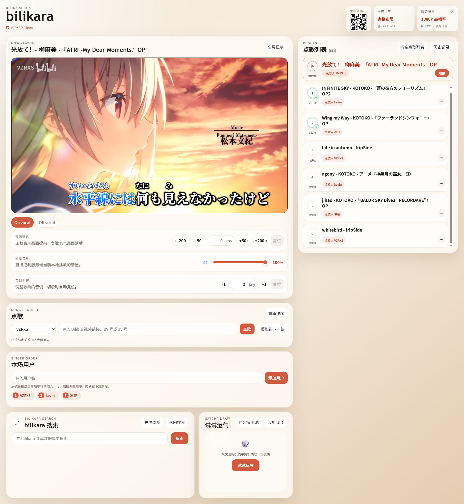
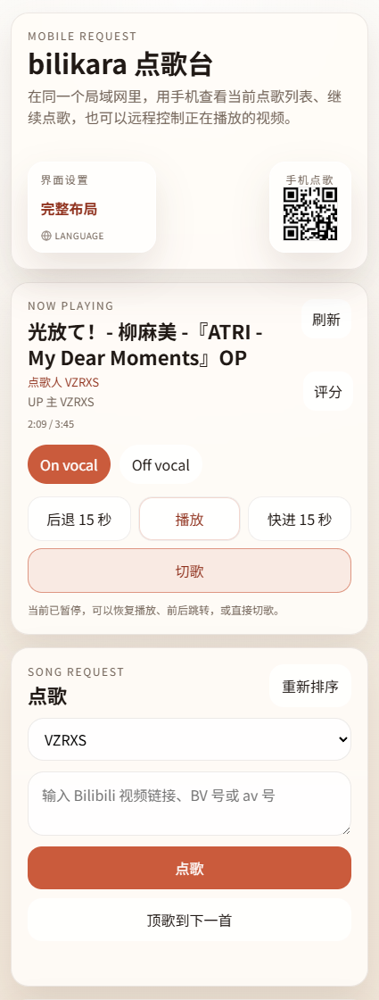
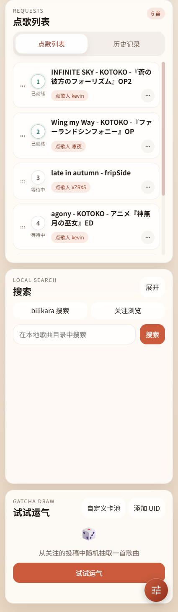
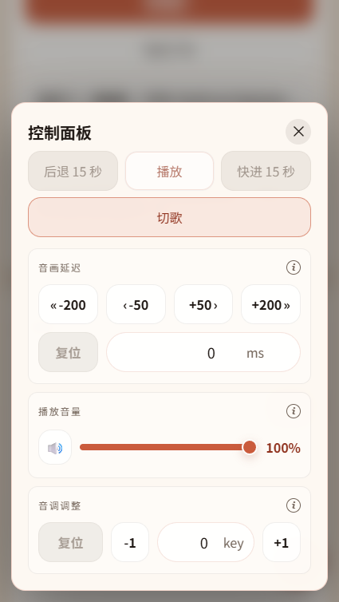
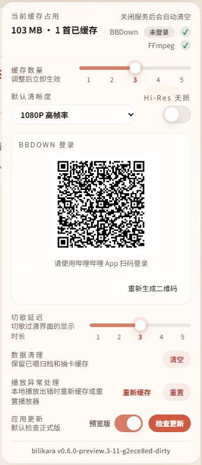

本fork将作为独立fork区别于bilikara原仓库，目前提供的技术支持将保留(Cloudflare)

后续更新将不会独自再向原仓库推送，同时不会在没有确认的情况下拉取原仓库更新

使用bilikara的用户请移步upstream

github.com/VZRXS/bilikara

---

# bilikara

---

`bilikara` 是一个基于 B 站卡拉 OK 视频的点歌平台。主要由 OpenAI Codex 协助设计与实现，并经过人工整理、验证与迭代。

<p align="center">
  <br>
  <sub>Host 界面</sub>
</p>

<table>
  <tr>
    <td align="center" valign="top" width="33%">
      <br>
      <sub>移动端控制台</sub>
    </td>
    <td align="center" valign="top" width="33%">
      <br>
      <sub>移动端控制台 (cont.)</sub>
    </td>
    <td align="center" valign="top" width="33%">
      <br>
      <sub>移动端播放控制面板</sub>
    </td>
  </tr>
</table>

## 当前版本功能

### 核心播放与缓存

- 通过 B 站视频链接或 BV 号加入点歌列表（支持链接指定分 p），后台自动进入本地缓存流程
- 本地播放基于 BBDown 和 FFmpeg 缓存媒体，浏览器端使用分离视频 / 音频播放器同步播放
- 支持毫秒级音画延迟补偿、独立音量控制、静音，以及 -6 ~ +6 key 的音调调整（切歌时自动复位）
- 音量、音画延迟、切歌延迟等播放器设置会本地记忆并在重新打开后恢复
- 可设置 1 ~ 5 秒切歌延迟；切歌时显示过渡画面，包含即将播放、倒计时和后续点歌列表
- 多分 p 视频自动判断有效分 p，自动缓存多音轨，可随时切换；切换时会同步当前播放进度与播放状态
- 加入点歌列表后自动后台缓存，缓存失败 / 长时间无变化显示重试按钮，并支持一键重试
- 缓存限制：最多只自动缓存前 1 ~ 5 首，默认 3 首，防止磁盘占用过大；服务关闭后自动清空缓存目录
- 扫描二维码登录 B 站账号（**注意：** 这里直接使用 BBDown 登录方案，Cookie 会明文保存在 `BBDown.data`）

### 列表、历史与导出

- 点歌列表中展示当前播放、缓存状态和完成标记
- 支持切歌、移除、拖拽排序、顶歌到下一首等控制操作
- 本地保留歌单和播放器设置备份，重新打开后自动恢复，支持手动清空备份
- 保留点歌历史记录（次数、时间、点歌人），支持从历史记录中快速重新点歌，也可删除单曲在历史记录和本场记录中的条目
- 维护本次点歌记录：同一首歌在本次已点过时，加入前会弹窗确认
- 在历史记录页面可以导出本场记录或全部历史为 CSV 或 PNG 歌单图片；图片每页歌曲数可选 50 ~ 200 首
- 自动保存对应视频的 UP 主信息，悬停列表或历史记录时可显示完整歌名与 UP 主信息
- 按场次单独保存“本次已唱”记录（JSON 格式），便于扩展读取接口
- 设置本场用户，可通过拖拽或列表排序管理点歌人顺序

<p align="center">
  <br>
  <sub>歌单导出图片</sub>
</p>

### 试试运气（Gatcha 自定义卡池）

- 试试运气（Gatcha）：内置 27 位初始 UP 主 UID，用户可按需自由添加其他 B 站 UID
- 自定义拉取：系统自动增量拉取关注 UP 主符合卡拉 OK 筛选条件（如带伴奏、KTV 等关键词）的稿件，并写入本地索引
- 关注浏览：支持按 UID 浏览本地索引的所有已收录稿件，方便按 UP 主点歌
- 收藏夹支持：输入 B 站 UID 即可拉取其公开收藏夹列表，预览并选择需要的收藏夹稿件导入本地索引
- 手动更新：支持一键全量刷新各 UID 的稿件列表，并自动将新增 BV 号同步上传共建共享曲库

### 共享曲库（Cloudflare D1 后端）

- 共享曲库共建：多用户点歌与拉取收藏夹时，新增的 BV 号自动去重汇总上传，实现曲库共建
- 远程搜索：快速搜索共享曲库中已收录的丰富稿件
- 分类索引浏览：
  - 按作品名 / 歌手名首字母（或假名）索引快速定位浏览
  - 按前端内置的约 40 个主题类别（热血、百合、VOCALOID、偶像、异世界等）进行浏览，并附带专属类别封面图
  - 按已导入的收藏夹目录浏览对应稿件
- LLM 数据自动标注：曲库定期使用大语言模型（LLM）对稿件进行标签（Tag）和拼音读音（Yomi）的智能化标注，大幅提升首字母定位与类别浏览体验

### 评价系统（Rating）

- 对已播放的歌曲支持进行 1 ~ 5 星匿名评分
- 评分数据提交至远程 D1 数据库并自动同步至 Google Sheets 备份，在云端计算稿件的平均分
- 在远程搜索和历史结果中展示评分人数与平均分

<p align="center">
  <br>
  <sub>评分界面</sub>
</p>

### 控制、设置与界面体验

- 同一局域网内手机端控制台支持：
  - 查看和调整点歌列表
  - 远程暂停 / 播放、前后跳转 15 秒、切歌
  - 切换音轨、调节音量、音画延迟、升降 key
- 移动端控制面板：
  - 播放控制收纳到悬浮球中，不干扰主页浏览
- 新点歌提示：Host 端全屏播放中收到新请求时，会在左上角弹出提示
- 服务设置：
  - 查看缓存占用，调整自动缓存数量
  - 调整默认清晰度、Hi-Res 优先、切歌延迟
  - 管理 BBDown 登录
  - 数据清理、重新缓存 / 重置播放器和应用更新检查
  - 源码脚本运行时，更新检查会跳转 GitHub Releases 页面；打包版运行时会自动下载更新并重启服务
- 界面设置：
  - 布局：基础 / 完整
  - 主题：浅橙 / 黑橙 / 黑蓝主题
  - 语言：中文（zh）/ 英文（en）/ 日文（ja）
  - Host 和 Remote 会分别记忆偏好

<table>
  <tr>
    <td align="center" valign="top" width="50%">
      <br>
      <sub>服务设置</sub>
    </td>
    <td align="center" valign="top" width="50%">
      <br>
      <sub>界面设置</sub>
    </td>
  </tr>
</table>

<table>
  <tr>
    <td align="center" width="50%">
      <br>
      <sub>切歌过渡画面</sub>
    </td>
    <td align="center" width="50%">
      <br>
      <sub>新点歌提示</sub>
    </td>
  </tr>
</table>

## 启动

**桌面版（Tauri）**

带 tag 的发布版会通过 GitHub Actions 打包；在 Releases 下载对应平台的压缩包后，优先运行桌面入口：

- Windows：`bilikara-desktop.exe`
- macOS：`Bilikara-Desktop.app`

桌面入口由 Tauri 提供窗口壳，启动时会自动拉起 Python 后端服务并打开 Host 界面；关闭桌面窗口后会请求后端退出并清理本次运行的缓存。

**后端 / 浏览器模式**

打包产物中也会保留 Python 后端可执行文件；后端包本身可直接使用，不依赖 Tauri 桌面壳。直接运行后端时，会自动打开系统浏览器进入 Host 界面。发布包中的后端入口通常是：

- Windows：运行 `bilikara.exe`
- macOS：运行 `bilikara.app`

**从源码启动**

```bash
python start_bilikara.py
```

或（Ubuntu）

```bash
./start_bilikara.sh
```

无论使用后端可执行文件还是源码脚本，启动后默认优先尝试 `http://127.0.0.1:8080`；如果默认端口被占用，会自动尝试后续端口。打开的本地页面全部关闭后，服务会在几秒内自动退出。

**提示：** Windows 打包版默认会优先尝试绑定当前探测到的局域网 IPv4，并尝试过滤出物理网卡；如果探测不到，会回退到 `0.0.0.0`。如果希望手动指定监听地址，可通过 `BILIKARA_HOST` 覆盖。

## 本地打包

项目现在分为两层打包：Python 后端包和 Tauri 桌面壳。

**Python 后端包**

构建时需要本地安装 Python。打包后得到的后端可执行文件本身就是完整的浏览器模式应用，会调用系统浏览器打开 Host 界面。

- Windows：`build_windows.bat`
- macOS：`build_macos.command`

它们会自动安装 `PyInstaller` 并生成打包产物到 `dist/`：

- Windows 通常会生成 `dist/bilikara/`，其中的 `bilikara.exe` 可直接双击运行
- macOS 会生成 `dist/bilikara.app`，可直接双击运行

**Tauri 桌面壳**

构建 Tauri 桌面壳需要安装 Node.js 和 Rust 工具链。开发模式可运行：

```bash
npm install
npm run dev
```

构建桌面壳可运行：

```bash
npm install
npm run build
```

CI 的正式打包流程会先构建 Python 后端包，再构建 Tauri 桌面壳，并把桌面入口放进最终发布包：Windows 为 `bilikara-desktop.exe`，macOS 为 `Bilikara-Desktop.app`。

补充说明：

- 打包后的应用会把静态页面资源封装进应用内部
- 发布包元数据中的发布者 / CompanyName 设置为 `VZRXS`；Windows 安全提示中的“已验证发布者”仍需要代码签名证书
- Tauri 桌面壳 `bilikara-desktop.exe` 会通过 `scripts/sign_windows.ps1` 签名；CI 可配置 `WINDOWS_SIGN_CERTIFICATE_BASE64` + `WINDOWS_SIGN_CERTIFICATE_PASSWORD`，也可改用 `WINDOWS_SIGN_CERTIFICATE_PATH` 或 `WINDOWS_SIGN_CERTIFICATE_THUMBPRINT`，未配置证书时会跳过签名并继续显示未知发布者
- 打包后的 `data/`、日志、缓存和工具文件默认都会写到应用目录内的 `runtime/`；如需改到其他位置，可通过 `BILIKARA_HOME` 指定应用数据目录
- 打包脚本会优先把构建机上的 `ffmpeg` / `ffprobe` 一起打进应用；启动时会把它们同步到 `runtime/tools/bbdown/`，与 `BBDown` 放在一起，缓存时优先使用这份应用内工具
- Tauri 桌面壳启动后会拉起同目录或相邻目录里的 Python 后端包；开发模式下会回退到 `python start_bilikara.py`
- 当前 Tauri 桌面版采用类似 sidecar 的 Python 后端进程方案；长期规划中，会考虑逐步将更适合桌面集成、进程管理和跨平台适配的能力迁移到 Rust / Tauri 侧
- Windows 和 macOS 的最终包通常需要在各自系统上分别构建；也就是说，Windows 包最好在 Windows 上打，macOS 包最好在 macOS 上打
- Windows 打包脚本会依次尝试 `py`、`python`、`python3`；如果都不存在，需要先安装 Python 3
- 如需排查后端打包版启动问题，可使用 `python build_bundle.py --console` 生成带控制台窗口的调试包

## 可选环境变量

- `BILIKARA_HOST`：监听地址；脚本启动默认 `0.0.0.0`，Windows 打包版默认优先使用探测到的局域网 IPv4，失败时回退到 `0.0.0.0`
- `BILIKARA_PORT`：监听端口，默认 `8080`
- `BILIKARA_HOME`：自定义应用数据目录；不设置时，打包版默认写入应用目录内的 `runtime/`
- `BILIKARA_MAX_CACHE_ITEMS`：自动缓存窗口大小，默认 `3`
- `BILIKARA_BILIBILI_COOKIE`：用于 BBDown 下载会员清晰度或受限内容的 cookie
- `BB_DOWN_PATH`：自定义本地 `BBDown` 可执行文件路径
- `FFMPEG_PATH`：自定义本地 `ffmpeg` 可执行文件路径
- `BILIKARA_STARTUP_LOG`：设为 `1` 时，启动日志会写入 `runtime/data/logs/startup.log`，用于排查打包版启动问题

## 技术说明

- 前端使用原生 HTML/CSS/JS，无需前端构建步骤；Node.js 仅用于构建 Tauri 桌面壳
- 后端使用 Python 标准库 HTTP 服务
- 桌面版使用 Tauri v2 / Rust 作为窗口壳，负责启动后端、承载本地 WebView，并在窗口关闭时请求后端退出
- 当前桌面壳不是纯 Rust 后端：它会启动一个类似 sidecar 的 Python 后端进程，后端仍负责 HTTP API、缓存、下载和状态管理
- Tauri 开发配置指向 `http://127.0.0.1:8080`，实际启动时会以 `--no-browser --headless --port 0` 拉起后端，并在收到 `bilikara.ready` 事件后跳转到真实本地地址
- 播放流程以本地缓存和本地媒体播放为主，缓存媒体由 `BBDown` 下载并由 `FFmpeg` 处理
- 本地缓存会优先使用本地已有的 `BBDown`；启动后会在后台静默检查是否需要更新
- 启动后也会在后台准备 `FFmpeg`，并把可用版本同步到应用目录内的 `runtime/tools/bbdown/`
- Windows 打包版会以隐藏进程方式调用 `BBDown`，避免点歌时弹出命令行窗口
- Windows 打包版默认优先监听一个具体局域网 IPv4，探测不到时再回退到 `0.0.0.0`，以尽量保留局域网手机访问能力
- `BBDown` 下载日志会写到应用数据目录下的 `data/logs/bbdown/`
- 本次已唱记录会单独写入 `data/played_sessions/played-YYYY-MM-DD_HH-MM-SS-ffffff.json`
- 如果 `BBDown` 返回“请尝试升级到最新版本后重试”这类提示，程序会自动强制刷新一次本地 BBDown 并重试当前下载
- 如果当前歌曲已经缓存完成，前端会使用浏览器里的分离视频 / 音频播放器播放本地文件
- 本地播放时，视频与音频流会分开同步，用来支持独立的音画延迟补偿、音量控制、静音和升降 key
- Host 页面和手机端控制台会共享同一套播放器设置，包括音画延迟、音量、静音状态和音调调整
- 歌单 CSV 由后端直接生成；歌单图片导出依赖 Pillow，并带有多字体 fallback 以尽量处理特殊符号和多语言标题
- 备份会保存歌单和播放器设置，不保存缓存媒体文件；恢复后会重新进入自动缓存流程

## 注意

- 本地缓存依赖运行环境能访问 B 站；首次自动下载或更新 `BBDown` 时还需要能访问 GitHub Releases
- 音画延迟补偿、音量控制、静音、远程暂停 / 跳转 / 切换音轨、升降 key 等能力依赖本地缓存媒体和浏览器媒体能力
- 图片导出需要 Pillow；打包依赖中已包含 Pillow，脚本运行环境如果缺失则只能导出 CSV
- `FFmpeg` 状态会显示在右上角 `BBDown` 展开面板中，方便定位“BBDown 已就绪但混流失败”这类问题
- 如果 Windows 后端打包版出现启动异常或页面打不开，可先尝试 `python build_bundle.py --console`，或设置 `BILIKARA_STARTUP_LOG=1` 收集启动日志
- Tauri 桌面入口会设置 `BILIKARA_LAUNCH_MODE=tauri` 和 `BILIKARA_STARTUP_LOG=1`，桌面启动问题通常可先查看 `runtime/data/logs/startup.log`
- 为了让本地播放支持拖动和快进，后端对缓存媒体实现了 `Range` 请求支持
- **macOS 打包版暂未在实体 macOS 设备上完整验证；目前只能确认脚本版流程可运行。**

## 致谢

- https://github.com/nilaoda/BBDown
- https://github.com/FFmpeg/FFmpeg

## License 与使用边界

本项目采用 [MIT License](LICENSE)。该许可仅适用于本项目自身的源代码和文档，不授予任何 B 站内容、音乐、视频、歌词、封面、字幕、公开播放、下载缓存、商业使用或第三方平台服务的授权。

`bilikara` 是用于本地 / 局域网卡拉 OK 点歌与播放管理的工具，不是 B 站下载器，也不应被作为视频、音频或其他平台内容的下载、保存、分发工具使用。

本地缓存仅服务于当前播放流程。服务退出后会自动清理已缓存内容；缓存媒体不属于本项目授权范围，相关权利仍归原权利人或对应平台所有。

使用者应自行确保使用场景符合相关法律法规、平台规则、版权要求，以及公开播放 / 商业使用所需的许可。请勿将本项目用于未经授权的下载、缓存、传播、公开播放、商业放映、规避访问限制、批量抓取或其他可能侵犯第三方权益或违反平台规则的用途。

更完整的法律边界、第三方工具说明和责任说明请阅读 [LEGAL.md](LEGAL.md) 和 [THIRD_PARTY_NOTICES.md](THIRD_PARTY_NOTICES.md)。
